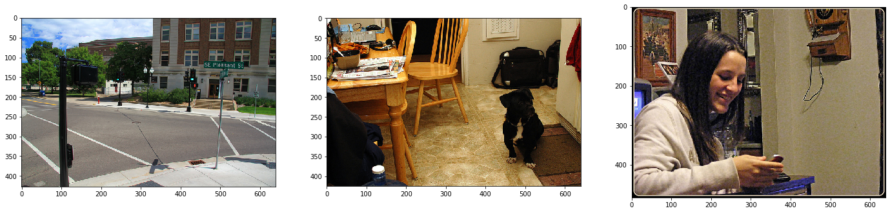
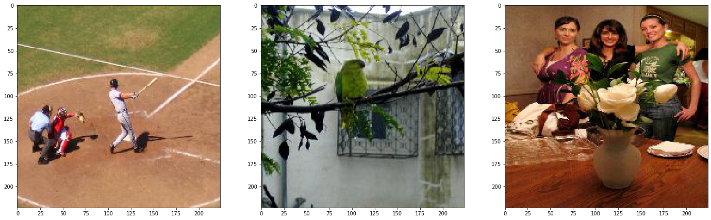
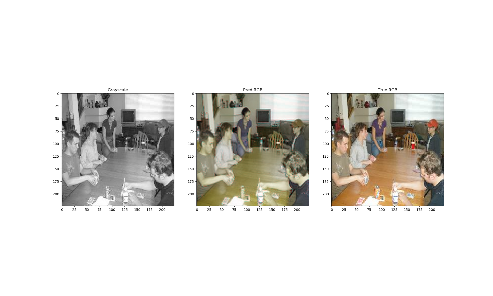
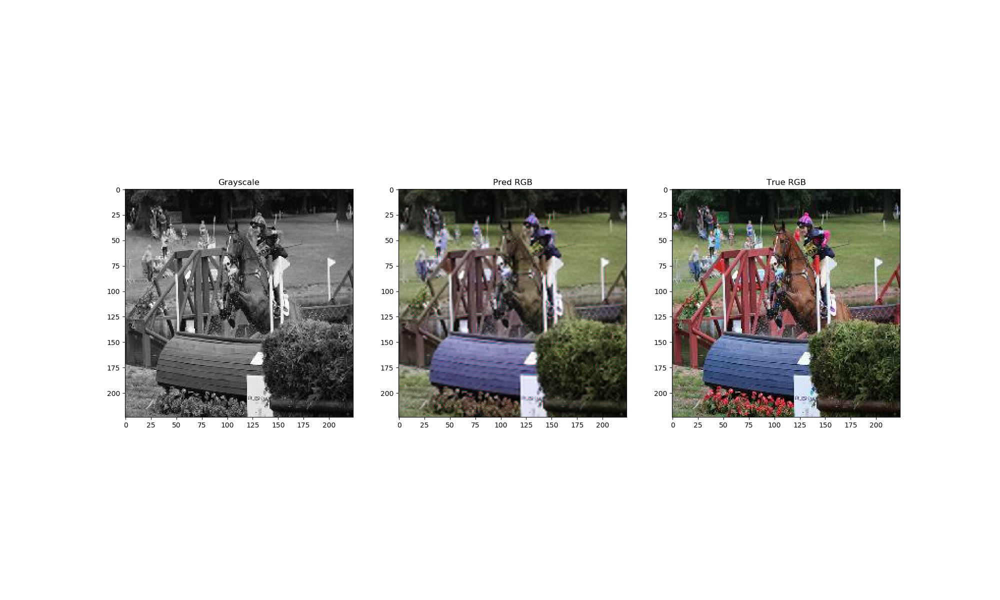

```python
import matplotlib.pyplot as plt
import numpy as np
import os
```

### Description of the project

The dataset I used is from [coco dataset](http://images.cocodataset.org/zips/train2014.zip) which is around 13 GB. I did not use the whole images but only the first ~20000 images.

The following is the original images


```python
random_imgs = np.random.choice(os.listdir('data/original/train2014'), 3)

fig, ax = plt.subplots(1,3, figsize=(24, 12))

for i in range(3):
    
    img = plt.imread('data/original/train2014/' + random_imgs[i])
    
    ax[i].imshow(img)
```





Next thing I did was to resize them 224 by 224


```python
random_imgs = np.random.choice(os.listdir('data/images'), 3)

fig, ax = plt.subplots(1,3, figsize=(24, 12))

for i in range(3):
    
    img = plt.imread('data/images/' + random_imgs[i])
    
    ax[i].imshow(img)
```





The next three images are from epochs of 1000, 10000, and 14000






It was not fully trained as computer rebooted while in training and lost optimizer weights (which I should have but forgot).

However it could identify objects and colorize them differently.

### Things used
1. GPU : GTX 1080 (8GB)
2. batch size : 16
3. optimizer : Adam with amsgrad
4. learning rate : 1e-4
5. Epochs : 14000

### Things I tried
1. Batch size of 32. This caused out of memory problem
2. 448 * 448 but this also caused out of memory
3. SGD with 1e-3. This was learning well but too slow (obviously).
    1. Maybe try this again with better GPU?

## TODO
1. Find a better dataset for training
2. Retrain the model with bigger batch (need to purchase new GPU)
3. ?
